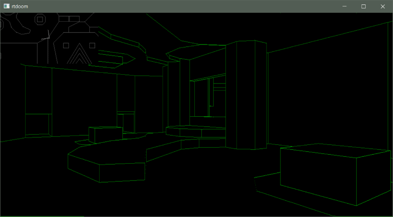
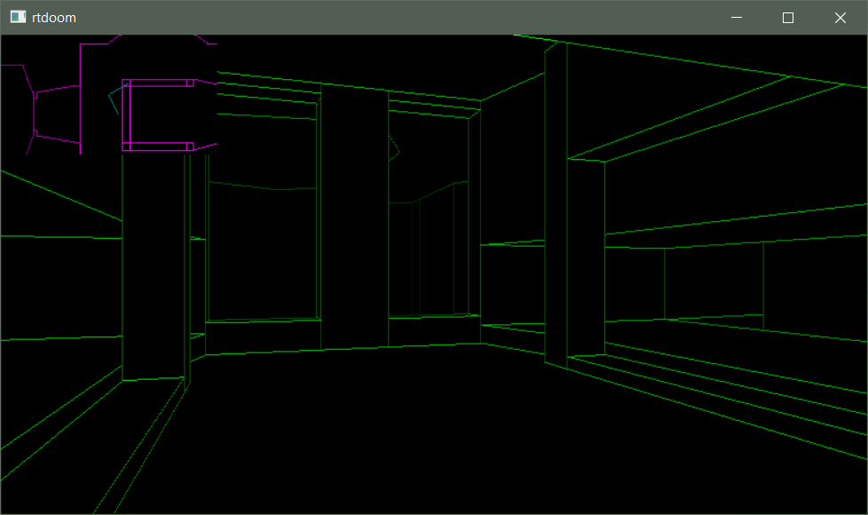

## rtdoom

An implementation of the Doom-style raycasting algorithm in modern C++.

### Features

* from-scratch software-based rendering implementation (no 3D libraries used)
* following originally used algorithms: BSP trees, no Z-buffer, in-place drawing
* ability to use the original Doom map format

### Screenshots

### Goal

While I follow original algorithms which were designed for resource-constrained architectures
the primary goal of this project is to provide an easily understandable implementation and
performance is not a focus (for example floating-point is used, objects are not reused as much
as they could etc.)

### Algorithm

See Fabien Sanglard's [Game Engine Black Book: DOOM](https://fabiensanglard.net/gebbdoom/) for a walkthrough
of algorithms used in the original game, most of which are replicated here.

### To Do

* textures
* sprites
* clipping
* parallelize!

### Code

* [ViewRenderer.cpp](rtdoom/ViewRenderer.cpp) contains the core of the frame rendering algorithm

Test program will render the view using SDL2, use arrow keys to move around and 1/2 to switch
rendering modes, built on Windows / Visual Studio 2017 using C++ 17 profile.

For copyright reasons the bundled map is not from the original game but from
the [Freedoom](https://freedoom.github.io/) project,
you can point the code at map data from original Doom WADs however.
