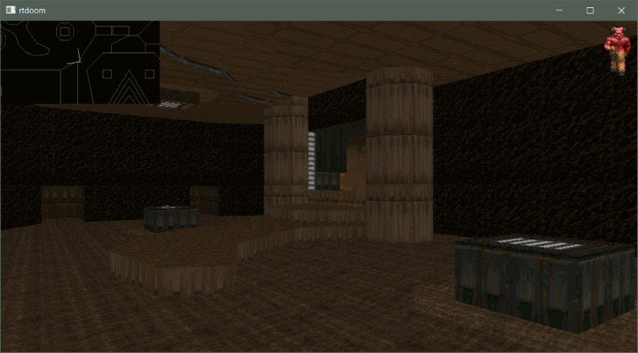

## rtdoom

Implementation of the Doom-style graphics engine in modern C++

### Features

* from-scratch software-based rendering implementation (no 3D libraries used)
* following originally used algorithms: BSP tree, no Z-buffer, no overdraw
* ability to load original Doom WAD files

### Screenshots

Wireframe mode

Solid mode

Textured mode

Step frame mode (see elements painted one by one)

### Goal

While I follow original algorithms which were designed for resource-constrained architectures
the primary goal of this project is to provide an easily understandable implementation and
performance is not a focus (for example floating-point is used, objects are not reused as much
as they could, many values are not precalculated etc.)

### Algorithm

See Fabien Sanglard's [Game Engine Black Book: DOOM](https://fabiensanglard.net/gebbdoom/) for a walkthrough
of algorithms used in the original game, most of which are replicated here.

### To Do

* sprites
* clipping
* optimize/parallelize!

### Code

* [ViewRenderer.cpp](rtdoom/ViewRenderer.cpp) contains the core of the frame rendering algorithm

Test program uses SDL2 to render the raw framebuffer in a screen window, controls are:
* arrow keys to move around
* 1/2/3 to switch between render modes (Wireframe/Solid/Textured)
* m to load the next map in the .wad file
* s to slow down rendering of the next frame to see individual parts being drawn
* Escape to exit

Built on Windows / Visual Studio 2017 using C++ 17 profile.

No assets included - you will need to drop off a .wad file from either the original Doom
(1 or 2, shareware is ok) or the [Freedoom](https://freedoom.github.io/) project into the .exe directory!
